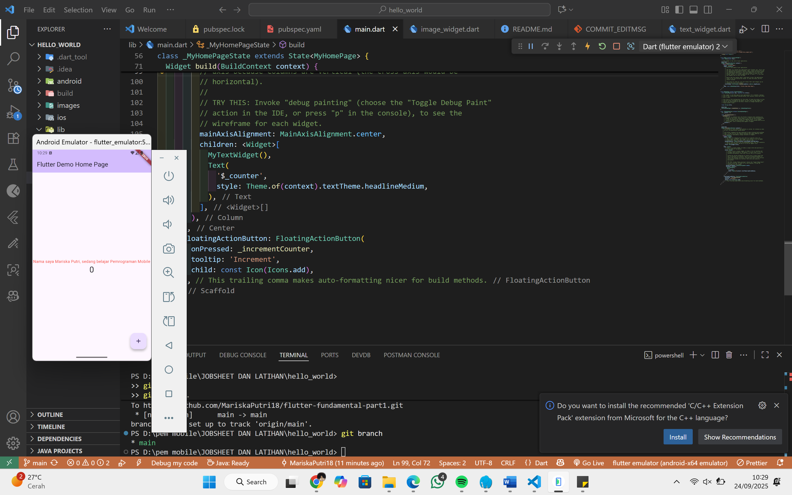
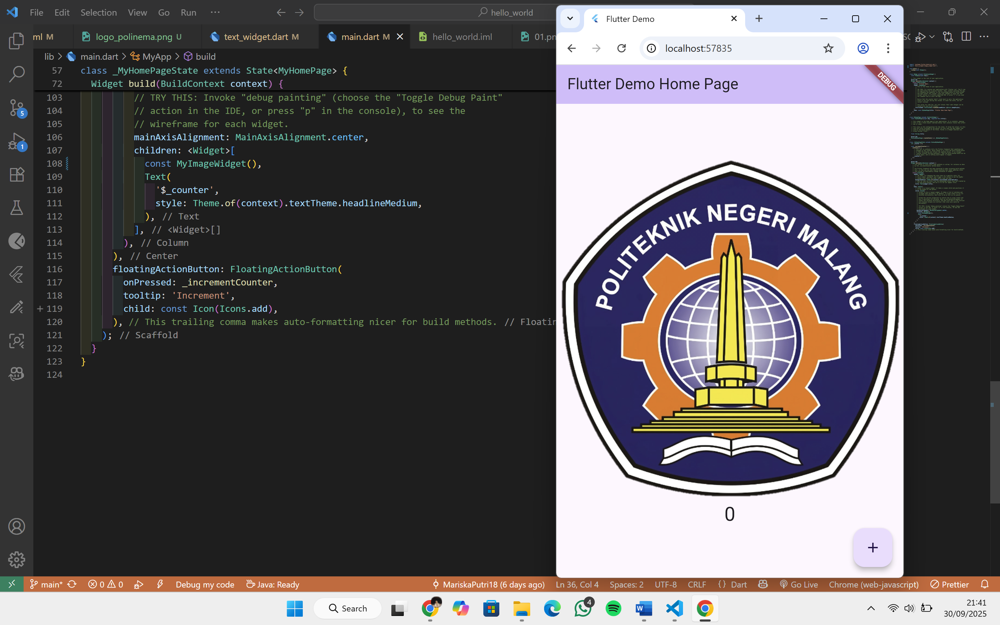
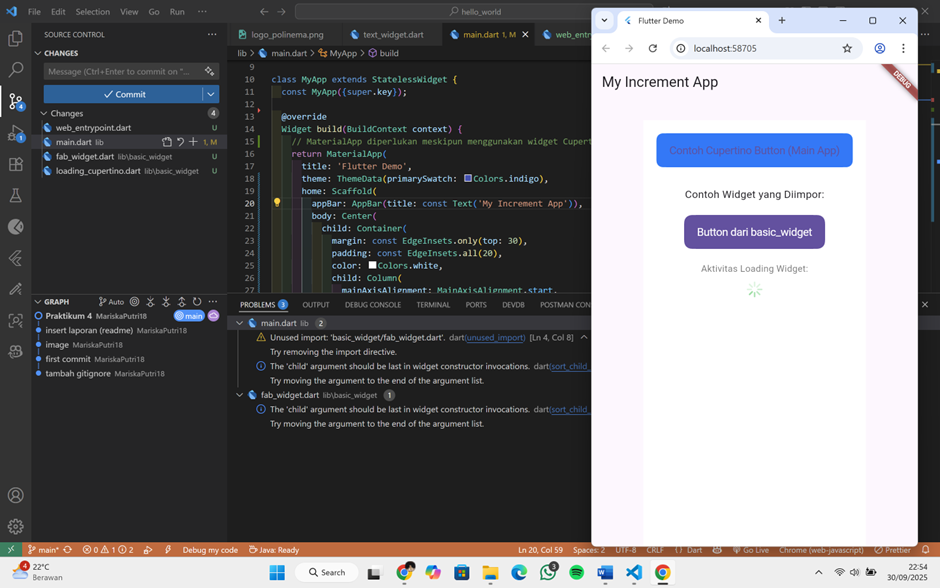
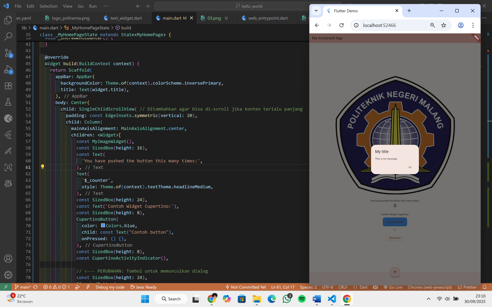
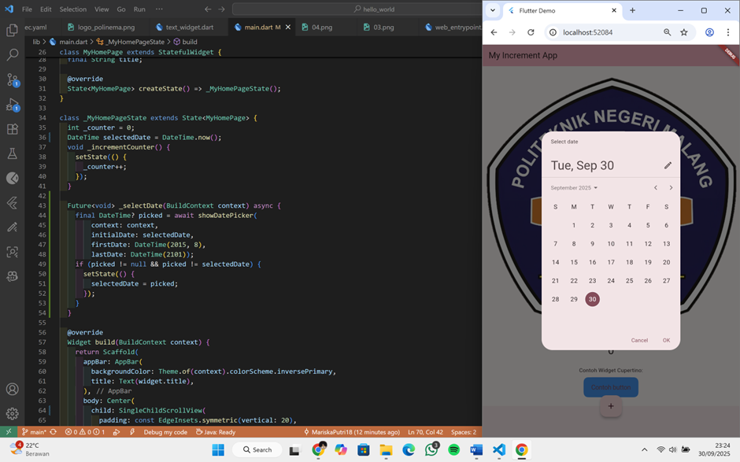

# hello_world

A new Flutter project.

## PRAKTIKUM 4: Menerapkan Widget Dasar

---

## PRAKTIKUM 5: Menerapkan Widget Material Design dan iOS Cupertino

---

### LAPORAN PRAKTIKUM

Untuk dokumentasi dan pembahasan lengkap praktikum ini, silakan lihat file PDF berikut:

[Jobsheet 5 - Mariska Putri (PDF)](PDF/23_MARISKA PUTRI_JOBSHEET 5.pdf)